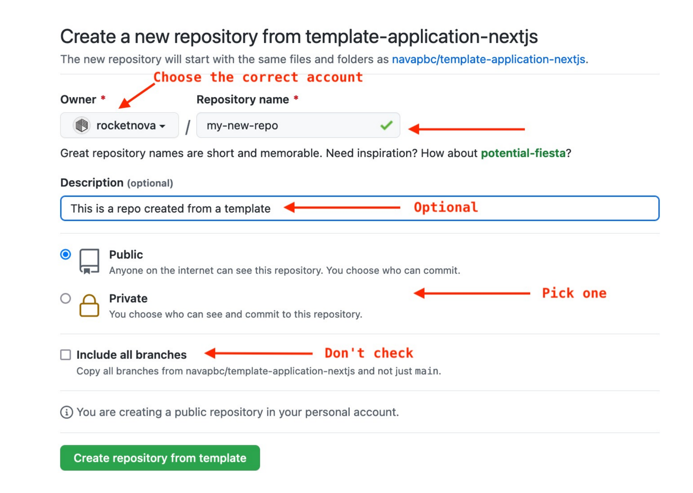
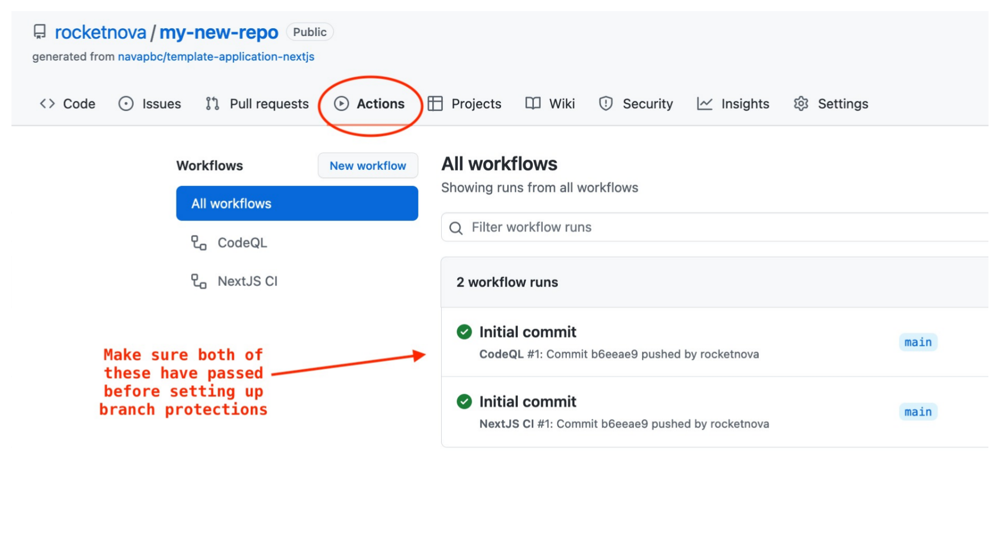
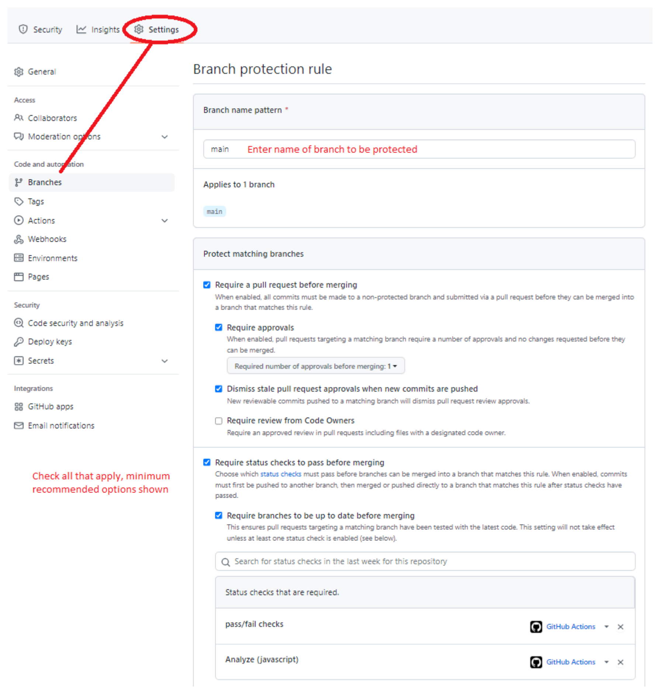
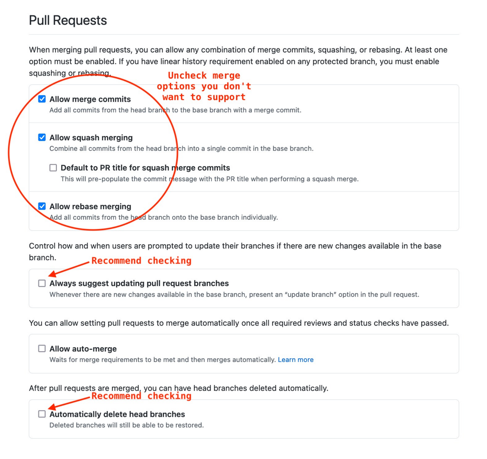
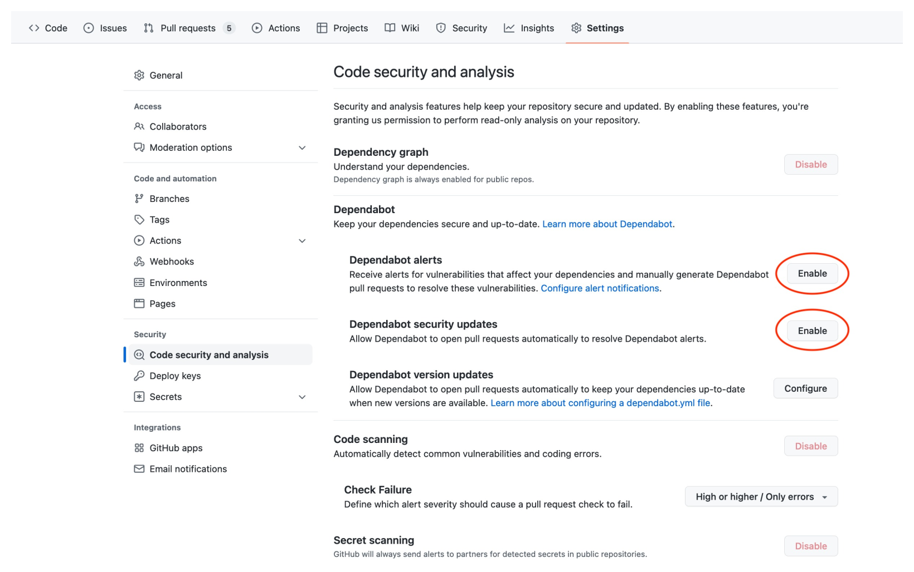

# Template repository for a Next.js application

This is a template repository for a Next.js-based application. While this template should be opinionated in some ways in order to reduce setup overhead where possible, it should be application-agnostic, meaning that any type of Next.js application should be able to be created from this template.

## Contents

This template includes setup for:

- `.github`: common GitHub configuration such as an empty PR template and a directory for GitHub workflows
- `app`: setup for the Next.js application should go here
- `docs`: a directory for project documentation
- `infra`: a directory for common infrastructure

## How to Run

### Without Docker

You can run the Next.js app without docker as follows:

1. `yarn install`
2. `yarn dev`
3. Navigate to `localhost:3000` in your browser to view the application

You can run storybook without docker by running:

1. `yarn storybook`
2. Navigate to `localhost:6006` in your browser to view storybook

### With Docker

The Next.js application is dockerized. Take a look at `./app/Dockerfile` to see how it works.

A `docker-compose.yml` has been included to support local development and deployment. Take a look at `./docker-compose.yml` for more information.

1. In your terminal, `cd` to this repo.
2. Make sure you have [Docker Desktop](https://www.docker.com/products/docker-desktop/) installed & running.
3. Run `docker-compose up -d --build` to build the image and start the container.
4. Navigate to `localhost:3000` in your browser to view the application. Note that it takes a few minutes for the initial sass compiling to complete and load.
5. Run `docker-compose exec nextjs yarn storybook` to build and run storybook. Note that the initial sass compiling for storybook also takes a few  minutes to complete and load
5. Navigate to `localhost:6006` in your browser to view storybook.
6. Run `docker-compose down` when you are done to delete the container.

To support local development, the `docker-compose.yml` runs the `nextjs` container in development mode (i.e. `yarn dev`) instead of production mode (i.e. `yarn start`). This allows Next.js to do things like hot reload.

The docker-compose file bind mounts `app` on the host machine to `/srv` in the guest machine. However, to ensure that the container uses the correct packages in `node_modules`, we use a named docker volume for the `node_modules` dir. The named volume will take precedence over the bind mount, so that the `node_modules` dir in the guest machine will not be overwritten with the host machine's `node_modules` dir. This also means that if you run `yarn add <package>` on the host machine in development (which will update `yarn.lock`), you'll also need to run `docker-compose exec nextjs yarn install --frozen-lockfile` to update `node_modules` in the guest machine.

## Getting started 

### Create a new repository from this template

The template repository can be used to create a project repository using two different methods.

1. From [Github](https://github.com/): Click [New](github.com/new) and select the desired template.
2. From the template repo itself: Click "Use this template".

### These steps are the same for both methods

- Select the repository owner
- Type in the desired repository name
- Type a description for this project
- Select whether this new repository will be Public or Private.
- Leave "Include all branches" unchecked
- Click "Create repository from template"

### Setup branch protections

Once the repository has been created, the CI stored in this template (`.github/workflows`) will run. Ensure initial CI completes successfully before proceeding.

- In Settings > Branches:
    - Click "Add branch protection rule"
    - Enter "main" for the Branch name pattern
    - Check the following:
        - Require a pull request before merging
        - Require approvals
            - Minimum of 1
        - Dismiss stale pull request approvals when new commits are pushed
    - Require status checks to pass before merging
    - Require branches to be up to date before merging
    - In the search box add the following:
        - pass/fail checks
        - Analyze (javascript)

### Setup other Github settings
- In Settings > General:
  - Under "Features": 
    - Enable/disable features that you want for your project. For example, turn off the Wiki if your project won't be using it
  - Under "Pull Requests": 
    - Enable only the merge options your project should support
    - Check "Always suggest updating pull request branches" to encourage pull requests to be updated when they deviate from `main`
    - Check "Automatically delete head branches" to keep set Github to automatically delete branches once they are merged into `main` in a PR

- In Settings > Collaborators:
  -  Add all collaborators that should have access to the git repo

- In Settings > Code security and analysis:
  - Click "Enable" for "Dependabot alerts"
  - Click "Enable" for "Dependabot security updates"
  - The other security features should already be enabled:
    - "Dependabot version updates" is controlled by `.github/dependabot.yml`
    - "Code scanning" is controlled by `.github/codeql-analysis.yml`
    - "Secret scanning" is enabled by default

### Clone the repo to your local development environment

Deploy the infrastructure from the infra folder by following the README.md instructions... I need to create the CD from [WMDP-96 Setup github actions for CD](https://wicmtdp.atlassian.net/browse/WMDP-96) then redo the steps above to verify if cd.yml will run, should also consider renaming ci.yml
