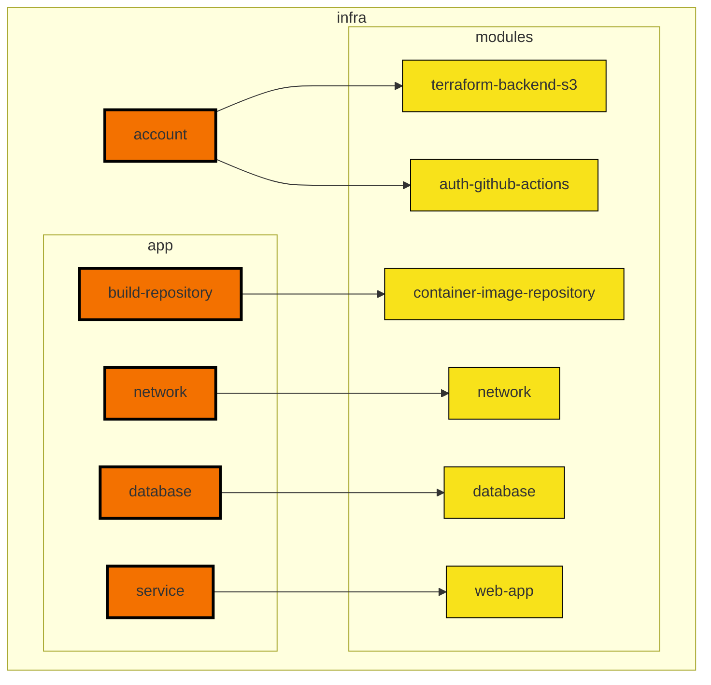
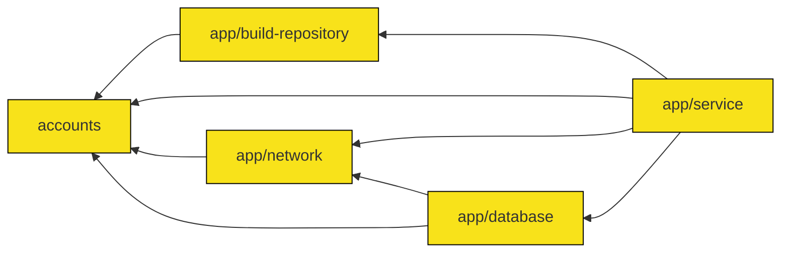

# Terraform module architecture

This doc describes how Terraform modules are structured.

## Code structure

The infrastructure code is organized as follows. [Root modules](https://www.terraform.io/language/modules#the-root-module) are modules that are deployed separately from each other, whereas child modules are reusable modules that are called from root modules.

```text
infra/                  Infrastructure code
  accounts/             Module for IaC and IAM resources
  app/                  Application-specific infrastructure
    build-repository/   Module for resources storing built release candidates used for deploys
    network/            (In development) Module for virtual network resources
    database/           (In development) Module for database resources
    service/            Modules for application service resources (load balancer, application service)
  modules/              Reusable child modules
```

## Module calling structure

The following diagram describes the relationship between modules and their child modules. Arrows go from the caller module to the child module.

Note that `static-app` does not currently exist, but is provided as an example of what the module architecture would look like if additional applications were added to the project repo.



## Module dependencies

The following diagram illustrates the dependency structure of the root modules.

1. Account root modules need to be deployed first to create the S3 bucket and DynamoDB tables needed to configure the Terraform backends in the rest of the root modules.
2. The application's build repository needs to be deployed next to create the resources needed to store the built release candidates that are deployed to the application environments.
3. The individual application environment root modules are deployed last once everything else is set up. These root modules are the ones that are deployed regularly as part of application deployments.


