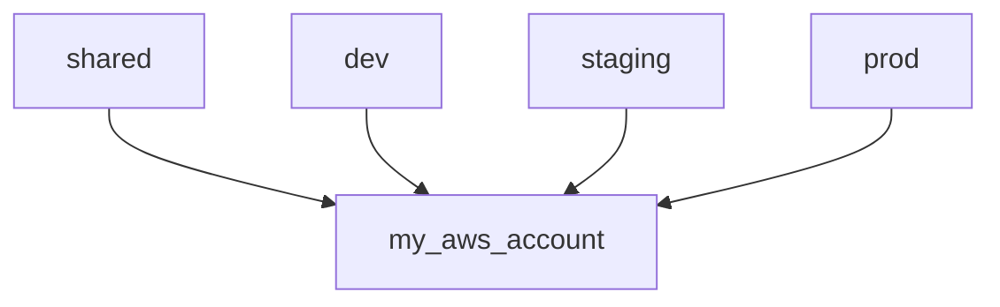
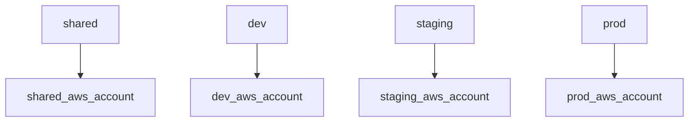
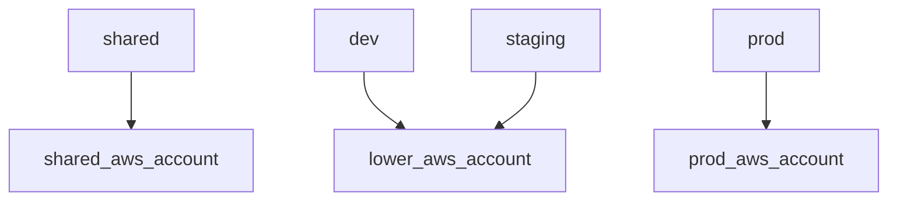

# Set up AWS accounts

The infrastructure supports managing resources across different [AWS accounts](https://docs.aws.amazon.com/accounts/latest/reference/accounts-welcome.html) by mapping different environments (e.g. `dev`, `staging`, `prod`) to specified AWS accounts. Resources that are shared across environments, such as build repositories, are also deployed into a specified AWS account.

The environment-to-AWS-account mapping is specified for each application deployed by this infrastructure. This means that multiple applications can share AWS accounts or be deployed into different AWS accounts.

The AWS account setup process will:

1. Determine AWS account strategy
2. Configure all AWS accounts

## Prerequisites

* You'll need to have [set up infrastructure tools](./set-up-infrastructure-tools.md), like Terraform, AWS CLI, and AWS authentication.

## Instructions

### 1. Decide on AWS account strategy

A simple project might have only one AWS account and all environments should be deployed to this environment. This mapping might look like this:

A more complex project might have separate AWS accounts for environment, enhancing security by isolating each environment into completely separate AWS accounts. This mapping might look like this:

A project could also isolate just the `prod` environment and group the lower environments:

Decide on the strategy that is appropriate for your project.

### 2. Ensure AWS account(s) have been created

For **each** AWS account you wish to use, ensure it has been created in AWS and you are able to authenticate to it.

### 3. Set up AWS account

For **each** AWS account you wish to use, [set up the AWS account](./set-up-aws-account.md).