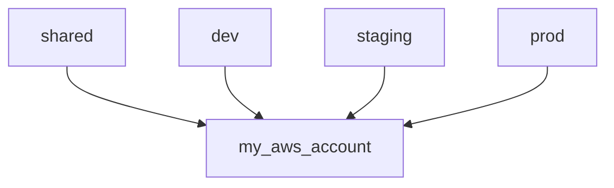
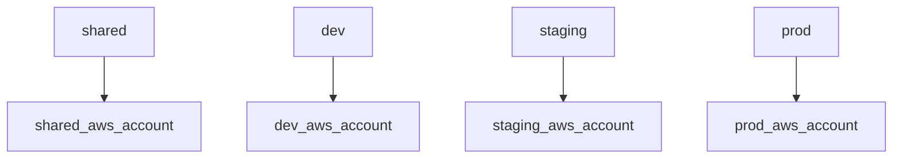
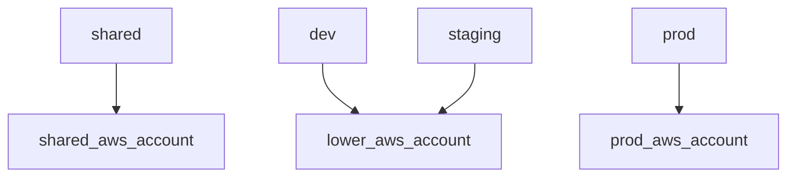

# Set up AWS accounts

The AWS accounts setup process will:

* Help you decide on your environments
* Help you decide on your AWS account strategy
* Configure all of your AWS accounts

## Prerequisites

* You have [set up infrastructure developer tools](/docs/infra/set-up-infrastructure-tools.md).

## Instructions

### 1. Decide on environments

The names of your environments must be consistent for all applications. By default, the environments are:

* `dev`
* `staging`
* `prod`

You can changes these names, add additional environments, or delete any these environments. You must have at least one environment. You can always add new environments or delete existing environments later.

### 2. Decide on AWS account strategy

This template supports managing resources in multiple [AWS accounts](https://docs.aws.amazon.com/accounts/latest/reference/accounts-welcome.html). To do so, each environment (e.g. `dev`, `staging`, `prod`) is mapped to a specified AWS account. Resources that are shared across environments, such as build repositories, are also explicitly mapped to a specified AWS account. In the following diagrams, these are represented by the box labeled `shared`.

The environment-to-AWS-account mapping is specified for each application. Multiple applications can share AWS accounts.

A simple project might have only one AWS account and all environments should be deployed to this environment:

A more complex project might have separate AWS accounts for environment, enhancing security by isolating each environment into completely separate AWS accounts:

A project could also isolate just the `prod` environment and group the lower environments:

Decide on the strategy that is appropriate for your project.

### 3. Ensure AWS account(s) have been created

For **each AWS account** you wish to use, ensure the AWS account has been created and you are able to authenticate to it.

### 4. Set up AWS account

For **each AWS account** you wish to use, [set up the AWS account](./set-up-aws-account.md).