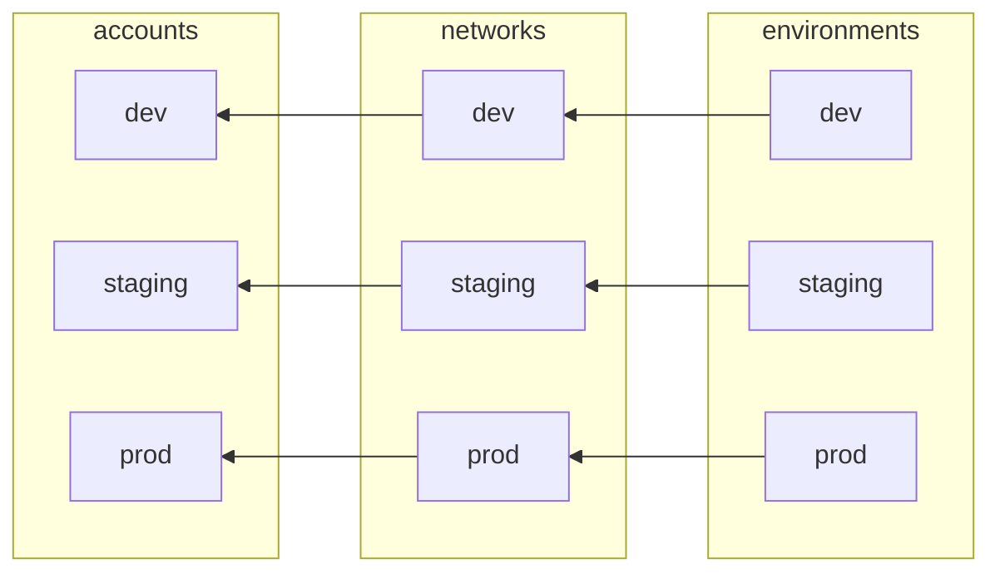
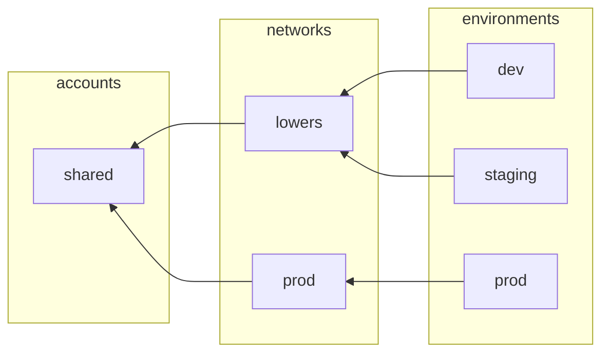

# System Architecture

This diagram shows the system architecture.

* **Access Logs** — Amazon S3 bucket storing the application service's access logs.
* **Alarms SNS Topic** — SNS topic that notifies the incident management service when an alarm triggers.
* **Application Load Balancer** — Amazon application load balancer.
* **Aurora PostgreSQL Database** — Amazon Aurora Serverless PostgreSQL database used by the application.
* **Build Repository ECR Registry** — Amazon ECR registry that acts as the build repository of application container images.
* **CloudWatch Alarms** — Amazon CloudWatch Alarms that trigger on errors and latency.
* **CloudWatch Evidently Feature Flags** — Amazon CloudWatch Evidently service that manages feature flags used by the application to manage feature launches.
* **Database Role Manager** — AWS Lambda serverless function that provisions the database roles needed by the application.
* **GitHub** — Source code repository. Also responsible for Continuous Integration (CI) and Continuous Delivery (CD) workflows. GitHub Actions builds and deploys releases to an Amazon ECR registry that stores Docker container images for the application service.
* **Incident Management Service** — Incident management service (e.g. PagerDuty or Splunk On-Call) for managing on-call schedules and paging engineers for urgent production issues.
* **Service** — Amazon ECS service running the application.
* **Terraform Backend Bucket** — Amazon S3 bucket used to store terraform state files.
* **Terraform Locks DynamoDB Table** — Amazon DynamoDB table used to manage concurrent access to terraform state files.
* **VPC Endpoints** — VPC endpoints are used by the Database Role Manager to access Amazon Services without traffic leaving the VPC.
* **VPC Network** — Amazon VPC network.

## Application environments

Example project with a single account and a shared VPC "lowers" for lower environments

